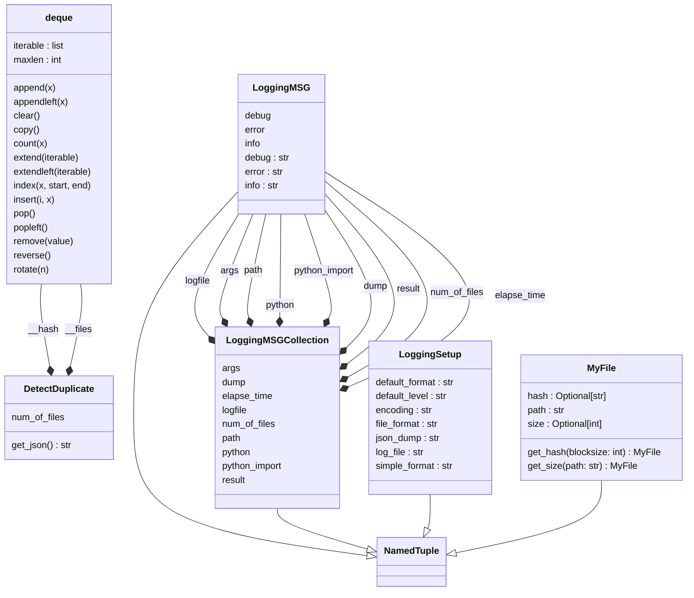

# Duplicate file finder
[](https://forthebadge.com)


## Description:

Yes, another duplicate file finder with Python...

There are various approaches to finding duplicate files using Python, but 
when working with a large number of files, such as 2400 files, a simple 
script may be inefficient and may consume a large amount of memory, 
potentially causing the environment to crash. In this case, we tried using a 
tool, but found that the analysis process was time-consuming and the user 
interface was not very efficient.

In my opinion, a duplicate file is one that has the same content as another 
file, which can be determined by comparing its size and hash value. As a 
solution, we decided to use Python to filter the files by size and to 
enhance the hash step using the xxhash library. This allowed us to 
effectively identify and handle duplicate files in a more efficient manner.


Whats this script do:
- file duplicate analysis
- report through the ssh
- dump a JSON file

What this script dont do:
- delete files
- make the cofee
- bitcoin analysis

## Use:

```shell
$ find-duplicate
USAGE: find-duplicate [-h] [--version] [--debug] [--logfile] [--dump] -p PATH

DESCRIPTION:
    This module find duplicate files in a path using "-p <path>" option with
    the command line.

OPTIONS:
  -h, --help            show this help message and exit
  --version             show program's version number and exit
  --debug               print debug messages to stderr
  --logfile             generate a logfile - "report.log"
  --dump                generate a summary - "summary_<id>.json"

REQUIRED ARGUMENTS:
  -p, --path PATH       define the /path/to/check

COMPATIBILITY:
    Python 3.7+ - https://www.python.org/

EXIT STATUS:
    This script exits 0 on success, and >0 if an error occurs.

HISTORY:
    0.1.0:  First release
```

## Install:
### Requirements

#### Runtime

```
python 3.7.x+
```

#### Python requirements
This packages are installed automatically.
```
rich>=12.6.0'
rich_argparse>=0.6.0'
xxhash>=3.1.0
```

### User
```shell
$ git clone https://github.com/francois-le-ko4la/duplicate-file-finder.git
$ cd duplicate-file-finder
$ make install
```

### Dev
#### Setup

We did a Makefile to install all packages.

```shell
$ make venv
$ source venv/bin/activate
$ make devinstall
$ make test
```

#### UML Diagram


## License

This package is distributed under the [GPLv3 license](./LICENSE)
