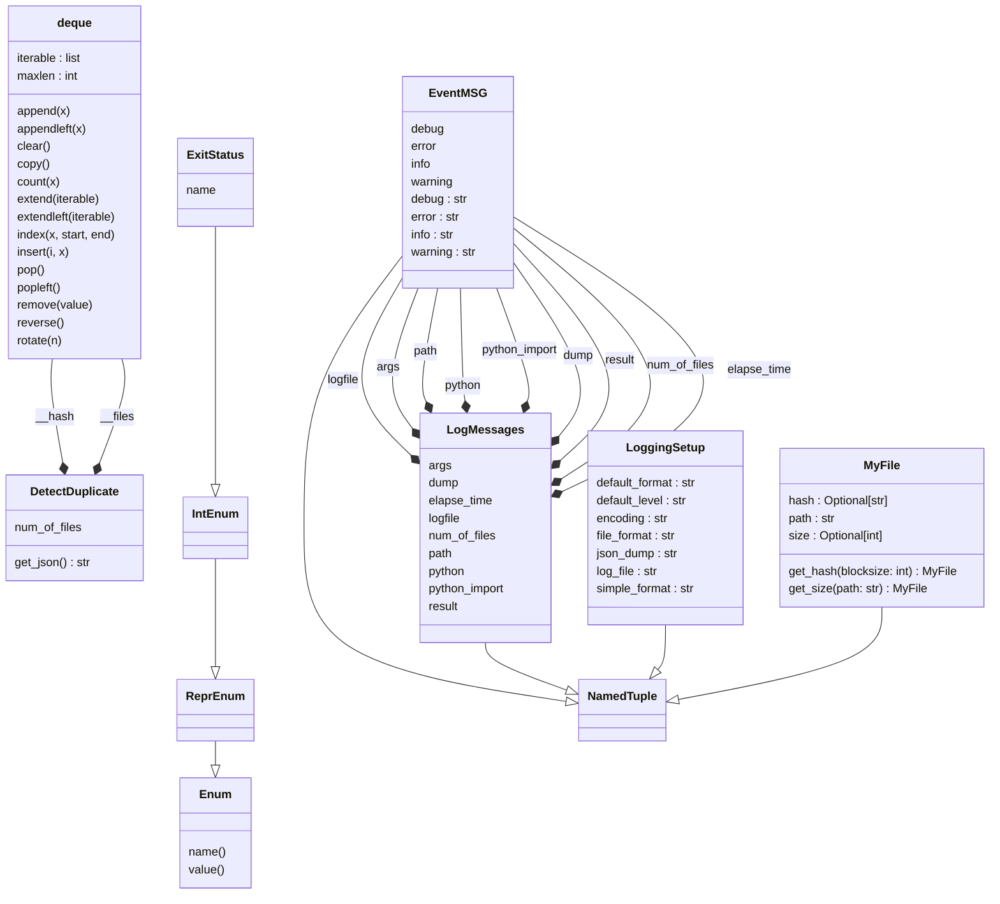

# Duplicate file finder:
[]()


# Description:

Yes, another duplicate file finder with Python...

There are various approaches to finding duplicate files using Python, but
when working with a large number of files, such as 2400 files, a simple
script may be inefficient and may consume a large amount of memory,
potentially causing the environment to crash. In this case, we tried using
a tool, but found that the analysis process was time-consuming and the user
interface was not very efficient.

In my opinion, a duplicate file is one that has the same content as another
file, which can be determined by comparing its size and hash value. As a
solution, we decided to use Python to filter the files by size and to
enhance the hash step using the xxhash library. This allowed us to
effectively identify and handle duplicate files in a more efficient manner.


Whats this script do:
- file duplicate analysis
- report through the ssh
- dump a JSON file

What this script dont do:
- delete files
- make the cofee
- bitcoin analysis

# Use:
```shell
$ find-duplicate
USAGE: find-duplicate [-h] [--version] [--debug] [--logfile]
                      [--dump] -p PATH

DESCRIPTION:
    This module find duplicate files in a path using "-p <path>" option
    with the command line.

OPTIONS:
  -h, --help            show this help message and exit
  --version             show program's version number and exit
  --debug               print debug messages to stderr
  --logfile             generate a logfile - "report.log"
  --dump                generate a summary - "summary_<id>.json"

REQUIRED ARGUMENTS:
  -p, --path PATH       define the /path/to/check

COMPATIBILITY:
    Python 3.7+ - https://www.python.org/

EXIT STATUS:
    This script exits 0 on success, and >0 if an error occurs.
```

# Compatibility:
Python 3.7+

# Setup:
- User:

Get the package:
```shell
git clone https://github.com/francois-le-ko4la/duplicate-file-finder.git
```
Change to the folder:
```shell
cd duplicate-file-finder
```
Install with make on Linux/Unix/MacOS or use pip3 otherwise:
```shell
make install
```

- Dev environment:

Get the package:
```shell
git clone https://github.com/francois-le-ko4la/duplicate-file-finder.git
```
Change to the folder:
```shell
cd duplicate-file-finder
```
Create your environment with all dev prerequisites and install the package:
```shell
make venv
source venv/bin/activate
make dev
```

# Test:
This module has been tested and validated on Ubuntu.
Test is available if you set up the package with dev environment.
```shell
make test
```

# License:
This package is distributed under the [GPLv3 license](./LICENSE)
# Dev notes
## TOML file:

```toml

# -*- coding: utf-8 -*-
[project]
name = "duplicatefile"
version = "0.1.1"
authors = [
  {name = "ko4la" }
]
description = "This module find duplicate files in a path."
license = {file = "LICENSE"}
requires-python = ">=3.7"
classifiers = [
    "Development Status :: 5 - Stable",
    "Environment :: Console",
    "Intended Audience :: Developers",
    "Programming Language :: Python :: 3",
    "Programming Language :: Python :: 3.7",
    "Programming Language :: Python :: 3.8",
    "Programming Language :: Python :: 3.9",
    "Programming Language :: Python :: 3.10",
    "Programming Language :: Python :: 3.11",
    "Programming Language :: Python :: 3 :: Only",
    "OSI Approved :: GNU General Public License v3 (GPLv3)",

]
dependencies = [
    'rich>=12.6.0',
    'rich_argparse>=0.6.0',
    'xxhash>=3.1.0'
    ]

[project.optional-dependencies]
dev = [
    "pycodestyle>=2.3.1",
    "pytest>=7.2.0",
    "pylint",
    "mypy",
    "pydocstyle",
    "pytest-pylint",
    "pytest-pycodestyle",
    "pytest-mypy",
    "pytest-pydocstyle",
    "pytest-isort",
    "types-setuptools"]

[project.urls]
"Homepage" = "https://github.com/francois-le-ko4la/duplicate-file-finder"

[project.scripts]
find-duplicate = "duplicatefile.duplicatefile:main"

[build-system]
requires = ["setuptools"]
build-backend = "setuptools.build_meta"

[tool.pytest.ini_options]
minversion = "7.2"
addopts = [
    "-v",
    "--pycodestyle",
    "--doctest-modules",
    "--mypy",
    "--pydocstyle",
    "--pylint",
    "--isort",
    "--strict-markers"
]
python_files = ["*.py"]
xfail_strict = true
filterwarnings = [
    "ignore:.*U.*mode is deprecated:DeprecationWarning",
    "ignore::DeprecationWarning"]

[tool.mypy]
disallow_any_generics = true
disallow_untyped_defs = true
warn_redundant_casts = true
strict_equality = true


```
## UML Diagram:


## Objects:

[ExitStatus()](#exitstatus)<br />
[LoggingSetup()](#loggingsetup)<br />
[EventMSG()](#eventmsg)<br />
[LogMessages()](#logmessages)<br />
[get_argparser()](#get_argparser)<br />
[MyFile()](#myfile)<br />
[MyFile.get_size()](#myfileget_size)<br />
[MyFile.get_hash()](#myfileget_hash)<br />
[DetectDuplicate()](#detectduplicate)<br />
[@Property DetectDuplicate.num_of_files()](#property-detectduplicatenum_of_files)<br />
[DetectDuplicate.get_json()](#detectduplicateget_json)<br />
[check_python()](#check_python)<br />
[define_logfile()](#define_logfile)<br />
[check_arg()](#check_arg)<br />
[dump_result()](#dump_result)<br />
[main()](#main)<br />
### ExitStatus()
```python
class ExitStatus(IntEnum):
```
<pre>

Define Exit status.

</pre>
### LoggingSetup()
```python
class LoggingSetup(NamedTuple):
```
<pre>

Define logging Parameters.

</pre>
<b>Examples:</b>
```python

>>> my_setup = LoggingSetup()
>>> my_setup.default_level
'INFO'


```
### EventMSG()
```python
class EventMSG(NamedTuple):
```
<pre>

Define Messages with different sev.

<b>Attributes:</b>
    info (str): message for info ("" by default)
    warning (str): message for warning ("" by default)
    error (str): message for error ("" by default)
    debug (str): message for debug ("" by default)

</pre>
<b>Examples:</b>
```python

    >>> logfile = EventMSG(info="Log file used: %s")
    >>> logfile.info
    'Log file used: %s'


```
### LogMessages()
```python
class LogMessages(NamedTuple):
```
<pre>

Set standard logging messages.

</pre>
### get_argparser()
```python
def get_argparser() -> ArgumentParser:
```
<pre>

Define the argument parser.

This function define the argument parser and return it.
<b>Returns:</b>
    ArgumentParser
</pre>
<b>Examples:</b>
```python

    >>> a = get_argparser()
    >>> type(a)
    <class 'argparse.ArgumentParser'>


```
### MyFile()
```python
class MyFile(NamedTuple):
```
<pre>

Describe a file with a NamedTuple.

@classmethod is used to init the objects correctly.

<b>Notes:</b>
    The objective is to define a file with only one NamedTuple.
    The NamedTuple will be created by the get_size function to define the
    path and size.
    Hash information consumes resources, and it will calculate later with
    get_hash function to create a new NamedTuple.

</pre>
<b>Examples:</b>
```python

    >>> test = MyFile.get_size("test_fic/doc.txt")
    >>> test
    MyFile(path='test_fic/doc.txt', size=544)
    >>> test = test.get_hash()
    >>> test
    MyFile(path='test_fic/doc.txt', size=544, hash='a5cd732df22bfdbd')


```
#### MyFile.get_size()
```python
@classmethod
def MyFile.get_size(cls, path: str) -> MyFile:
```
<pre>

Define a Myfile obj with path.

This function create the MyFile object with the file's path,
file's size is initialized by default and hash is None by default.
The path is not tested here, because we use os.walk to get the file
list.

<b>Args:</b>
    path: The file's path.

<b>Returns:</b>
    MyFile

</pre>
<b>Examples:</b>
```python

    >>> test = MyFile.get_size('test_fic/doc.txt')
    >>> test
    MyFile(path='test_fic/doc.txt', size=544)


```
#### MyFile.get_hash()
```python
def MyFile.get_hash(self, blocksize: int = 65536) -> MyFile:
```
<pre>

Calculate file's hash and generate a new obj.

This function is used on an existing Myfile obj and recreate
a new MyFile obj.

<b>Args:</b>
  blocksize:  blocksize used to read the file. (Default value = 65536)

<b>Returns:</b>
    MyFile

    >>> test = MyFile.get_size('test_fic/doc.txt')
    >>> test = test.get_hash()
    >>> test
    MyFile(path='test_fic/doc.txt', size=544, hash='a5cd732df22bfdbd')

</pre>
### DetectDuplicate()
```python
class DetectDuplicate():
```
<pre>

Class to organize and find duplicate files.

</pre>
#### @Property DetectDuplicate.num_of_files()
```python
@property
def DetectDuplicate.num_of_files(self) -> int:
```
<pre>

Get the number of files.

<b>Returns:</b>
    int: Number of files.

</pre>
<b>Examples:</b>
```python

    >>> a = DetectDuplicate('test_fic/')
    >>> a.num_of_files
    5


```
#### DetectDuplicate.get_json()
```python
def DetectDuplicate.get_json(self) -> str:
```
<pre>

Get the result (JSON format).

<b>Returns:</b>
    str: result (JSON).

</pre>
<b>Examples:</b>
```python

    >>> a = DetectDuplicate('test_fic/')
    >>> print(a.get_json())
    {
        "path": "test_fic/",
        ...


```
### check_python()
```python
def check_python() -> bool:
```
<pre>

Check python version.

This function check Python version, log the result and return a status
True/False.

<b>Returns:</b>
    True if successful, False otherwise.

</pre>
<b>Examples:</b>
```python

    >>> check_python()
    True


```
### define_logfile()
```python
def define_logfile() -> None:
```
<pre>

Define the logfile.

This function set up the log to push log events in the report file.

</pre>
### check_arg()
```python
def check_arg(args: Namespace) -> bool:
```
<pre>

Check user's arguments.

This function check user's arguments, log info/error and return a status
True/False.

<b>Args:</b>
  args: Namespace.

<b>Returns:</b>
    True if successful, False otherwise.

</pre>
<b>Examples:</b>
```python

    >>> myargs = Namespace(path='/etc/')
    >>> check_arg(myargs)
    True


```
### dump_result()
```python
def dump_result(data: str) -> bool:
```
<pre>

Dump the result in a JSON file.

This function dump the JSON, log info/error and return a status True/False.

<b>Args:</b>
  data: JSON str.

<b>Returns:</b>
    True if successful, False otherwise.

</pre>
### main()
```python
def main() -> ExitStatus:
```
<pre>

Define the main function.

<b>Returns:</b>
    int: exit value

</pre>
